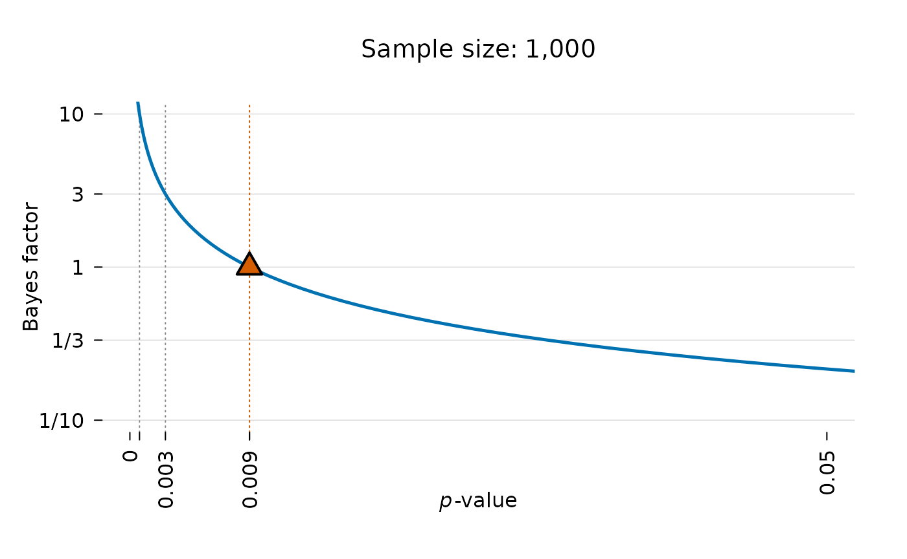
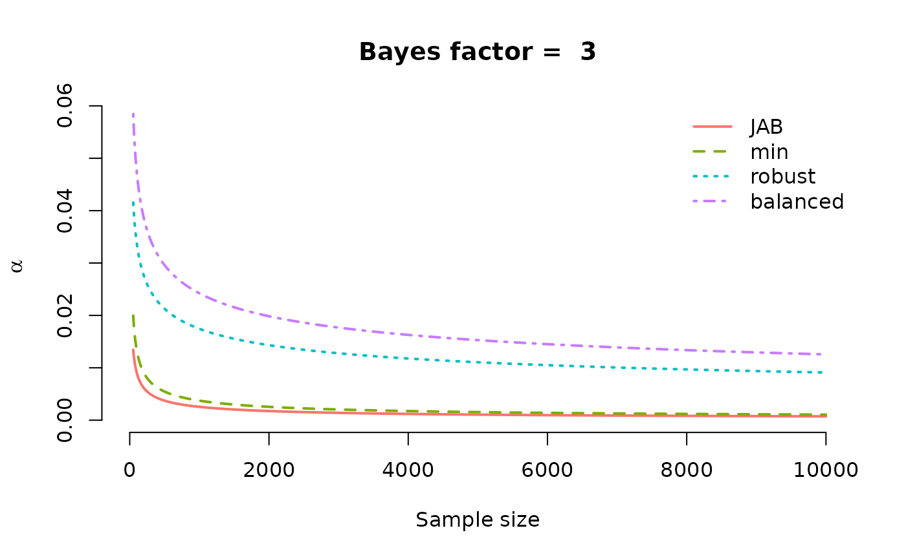

# Intro to alphaN

``` r

library(alphaN)
```

We wish to determine which alpha level is equivalent to a Bayes factor
of 1. I.e. only reject the null if the data is at least as likely under
the alternative as under the null. To do this, we need a way to connect
the $`p`$-value to the Bayes factor. The **alphaN** package does this
for tests of coefficients in regression models.

## Installation

To install the latest release version from CRAN use:

``` r

install.packages("alphaN")
```

You can install the development version of alphaN from
[GitHub](https://github.com/) with:

``` r

# install.packages("devtools")
devtools::install_github("jespernwulff/alphaN")
```

## Basic functionality

This vignette provides an introduction to the basic functionality of
**alphaN**. For full details on methodology, please refer to [Wulff &
Taylor (2024)](https://doi.org/10.1177/14761270231214429).

### Setting the alpha level

Using the `alphaN` function, we can get the alpha level we need to use
to obtain a desired level of evidence when testing a regression
coefficient in a regression model.

Here is an example: We are planning to run a linear regression model
with 1000 observations. We thus set `n = 1000`. The default `BF` is 1
meaning that we want to avoid Lindley’s paradox, i.e. we just want the
null and the alternative to be at least equally likely when we reject
the null.

``` r

alpha <- alphaN(n = 1000, BF = 1)
alpha
#> [1] 0.008582267
```

Therefore, to obtain evidence of at least 1, we should set our alpha to
0.0086.

### Plotting the relationship between the Bayes factor and *p*-value

The `alphaN` function works by mapping the *p*-value to the Bayes
factor. This relationship can be shown using the `JAB_plot`. For
instance:

``` r

JAB_plot(n = 1000, BF = 1)
```



The alpha level needed to achieve a Bayes factor of 1 is shown with a
red triangle in the plot. Lines for achieving Bayes factors of 3
(moderate evidence) and 10 (strong evidence) are also shown by default.
As it is evident a lower alpha level is needed to achieve higher
evidence.

### Alpha as a decreasing function of N

An important point of the procedure is that alpha will be set as a
function of sample size. The larger the sample size, the lower the alpha
needed such that a significant result can be interpreted as evidence for
the alternative.

The graph below illustrates this relationship for the previous example:

``` r

seqN <- seq(50, 1000, 1)
plot(seqN, alphaN(seqN), type = "l",
     xlab = "n", ylab = "Alpha")
```


### Setting the prior

To set the alpha level as a function of sample size, we need to choose
the prior carefully. **alphaN** allows the user to choose from four
sensible prior options based on suggestions from the previous
literature: Jeffreys’ approximate BF (`method = "JAB"`), the minimal
training sample (`method = "min"`), the robust minimal training sample
(`method = "robust"`), and balanced Type-I and Type-II errors
(`method = "balanced"`). `method = "JAB"` is a good choice for users who
want to be conservative against small effects, `method = "min"` is for
when the MLE is misspecified, `method = "robust"` is for when the MLE is
misspecified and the sample size is small, and `method = "balanced"` is
for when Type-II errors are costly.

For instance, to achieve evidence of 3 for 1,000 observations while we
ensure balanced error rates, we run

``` r

alphaN(1000, BF = 3, method = "balanced")
#> [1] 0.024221
```

The package contains the convenience function `alphaN_plot` that allows
a quick comparison of alpha as a function of sample size for the four
different methods:

``` r

alphaN_plot(BF = 3)
```



### Calibrating alpha to effect-size and moment Bayes factors

The four methods above all invert Jeffreys’ approximate Bayes factor,
whose prior places its mode on a null effect. Klauer, Meyer-Grant &
Kellen (2025) propose two alternative families of Bayes factors whose
priors instead center the alternative hypothesis on an effect size
$`d_e`$ chosen by the researcher: *effect-size* Bayes factors, and
*moment* Bayes factors, under which effects near zero are a priori
implausible. `alphaN` can calibrate the alpha level to these Bayes
factors, which answers the question: which alpha do I need so that a
significant result corresponds to a Bayes factor of at least `BF`
against an alternative centered on the effect size I actually care
about?

``` r

# alpha needed at n = 1000 for moderate evidence (BF = 3), targeting a
# medium-sized effect (de = 0.5)
alphaN(1000, BF = 3, method = "ES", de = 0.5)
#> [1] 0.002189564
alphaN(1000, BF = 3, method = "moment", de = 0.5)
#> [1] 0.0004913521
```

Because the moment prior rules out effects near zero, the alpha level it
implies falls much faster with the sample size than under JAB:

``` r

ns <- c(100, 1000, 10000)
round(rbind(JAB    = alphaN(ns, BF = 3),
            ES     = alphaN(ns, BF = 3, method = "ES"),
            moment = alphaN(ns, BF = 3, method = "moment")), 5)
#>           [,1]    [,2]    [,3]
#> JAB    0.00910 0.00255 0.00073
#> ES     0.01185 0.00219 0.00058
#> moment 0.00788 0.00049 0.00002
```

The prior settings follow the recommendations of Klauer et al. (2025)
and can be adjusted through the `nu` and `r` arguments; see
[`?alphaN`](https://jespernwulff.github.io/alphaN/reference/alphaN.md)
for details, including how to recover the calibration of the default
(Jeffreys-Zellner-Siow type) Bayes factor of Rouder et al. (2009).

### Bayes factors, joint tests, and clustered data

The Bayes factors behind `method = "ES"` and `method = "moment"` are
available directly through
[`klauerBF()`](https://jespernwulff.github.io/alphaN/reference/klauerBF.md),
so a reported test statistic can be converted into evidence under the
same prior that set the alpha level:

``` r

klauerBF(n = 80, t = 2.24, de = 0.5)
#> [1] 1.567758
```

For a joint test of several coefficients,
[`alphaN()`](https://jespernwulff.github.io/alphaN/reference/alphaN.md)
and
[`klauerBF()`](https://jespernwulff.github.io/alphaN/reference/klauerBF.md)
accept `q` (the number of coefficients tested) and `p` (the number of
retained parameters, including the intercept). This uses the exact
regression-case Bayes factors of Klauer et al. (2025), where the
targeted effect size is on Cohen’s f scale:

``` r

# Alpha for the joint F test of q = 2 coefficients at n = 200, targeting a
# medium effect
alphaN(200, BF = 3, method = "ES", q = 2, p = 2, de = sqrt(0.15))
#> [1] 0.008427417
```

Klauer et al. (2025) derive these Bayes factors under the normal linear
model (t tests, linear regression, ANOVA). For other generalized linear
models they apply in the same asymptotic sense as the four
prior-fraction methods, which is why the prior-fraction methods are the
natural choice for, say, a logit model with a modest sample.

Finally, for clustered (panel) data, Wulff & Taylor (2024) recommend
calibrating with the total number of observations, the conservative
choice, and then checking sensitivity with the effective sample size,
computed from the ratio of the classical to the cluster-robust standard
error:

``` r

# Cluster-robust SE twice the classical one: n_e is four times smaller
n_effective(n = 237, se = 0.1, se_robust = 0.2)
#> [1] 59.25
```
