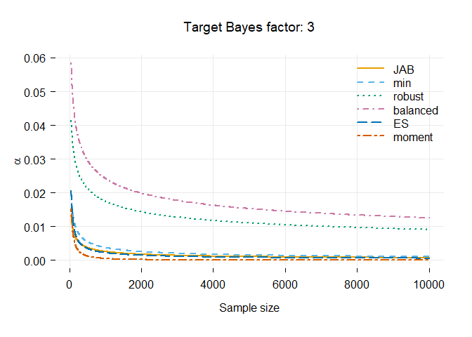
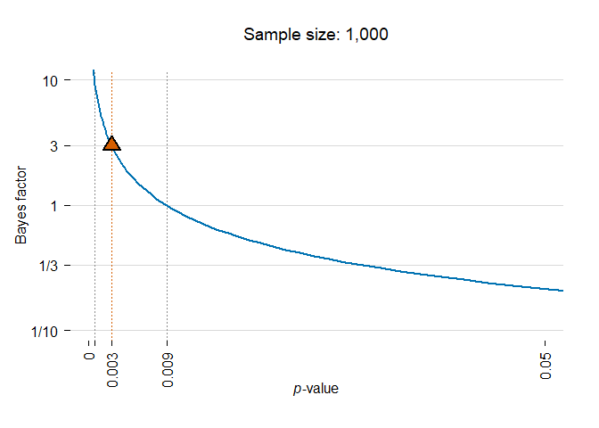

# alphaN

The goal of alphaN is to help the user set their significance level as a
function of the sample size. The function `alphaN` allows users to set
the significance level as function of the sample size based on the
evidence and the prior features they desire. The function `JABt` and
`JABp` converts test statistics and $`p`$-values into sample size
dependent Bayes factors. `JAB_plot` plots the Bayes factor as a function
of the $`p`$-value, and `alphaN_plot` plots the alpha level as a
function of sample size for a given Bayes factor.

Calculations are based on [Wulff & Taylor
(2024)](https://doi.org/10.1177/14761270231214429). If you enjoy the
package, please consider citing the paper (see `citation("alphaN")`).

As of version 0.2.0,
[`alphaN()`](https://jespernwulff.github.io/alphaN/reference/alphaN.md)
can also calibrate the alpha level to the effect-size and moment Bayes
factors of [Klauer, Meyer-Grant & Kellen
(2025)](https://doi.org/10.3758/s13423-024-02612-2), which center the
alternative hypothesis on an effect size of your choosing
(`method = "ES"` and `method = "moment"`).

If you’re not an R user, you may also be interested in the associated
[Shiny app](https://crossvalidated.shinyapps.io/alphaN/).

## Installation

To install the latest release version from CRAN use:

``` r

install.packages("alphaN")
```

You can install the development version of alphaN from
[GitHub](https://github.com/) with:

``` r

# install.packages("devtools")
devtools::install_github("jespernwulff/alphaN")
```

## Examples

Here is an example: We are planning to run a linear regression model
with 1000 observations. We thus set `n = 1000`. The default `BF` is 1
meaning that we want to avoid Lindley’s paradox, i.e., we just want the
null and the alternative to be at least equally likely when we reject
the null.

``` r

library(alphaN)

alpha <- alphaN(n = 1000, BF = 1)
alpha
#> [1] 0.008582267
```

Therefore, to obtain evidence of at least 1, we should set our alpha to
0.0086.

### Targeting stronger evidence, and choosing the prior

Raising `BF` asks for more evidence before you are allowed to reject,
which lowers alpha. The `method` argument selects the prior behind
Jeffreys’ approximate Bayes factor:

``` r

# Moderate (BF = 3) and strong (BF = 10) evidence at n = 1000
alphaN(n = 1000, BF = 3)
#> [1] 0.002549145
alphaN(n = 1000, BF = 10)
#> [1] 0.0006911392

# Balancing Type I and Type II error rates instead of the default prior
alphaN(n = 1000, BF = 3, method = "balanced")
#> [1] 0.024221
```

### Calibrating alpha to effect-size and moment Bayes factors

The methods `"ES"` and `"moment"` (new in 0.2.0) answer the question:
which alpha do I need so that a significant result corresponds to a
Bayes factor of at least `BF` against an alternative centered on the
effect size `de` I actually care about?

``` r

# Moderate evidence, targeting a medium-sized effect (Cohen's d = 0.5)
alphaN(1000, BF = 3, method = "ES", de = 0.5)
#> [1] 0.002189564
alphaN(1000, BF = 3, method = "moment", de = 0.5)
#> [1] 0.0004913521
```

Because the moment prior treats effects near zero as a priori
implausible, the alpha it implies falls much faster with the sample size
than under JAB:

``` r

ns <- c(100, 1000, 10000)
tab <- rbind(JAB    = alphaN(ns, BF = 3),
             ES     = alphaN(ns, BF = 3, method = "ES"),
             moment = alphaN(ns, BF = 3, method = "moment"))
colnames(tab) <- paste0("n = ", ns)
round(tab, 5)
#>        n = 100 n = 1000 n = 10000
#> JAB    0.00910  0.00255   0.00073
#> ES     0.01185  0.00219   0.00058
#> moment 0.00788  0.00049   0.00002
```

### Turning regression output into Bayes factors

[`JAB()`](https://jespernwulff.github.io/alphaN/reference/JAB.md)
computes Jeffreys’ approximate Bayes factor for a coefficient directly
from a fitted [`lm()`](https://rdrr.io/r/stats/lm.html) or
[`glm()`](https://rdrr.io/r/stats/glm.html) object;
[`JABt()`](https://jespernwulff.github.io/alphaN/reference/JABt.md) and
[`JABp()`](https://jespernwulff.github.io/alphaN/reference/JABp.md) do
the same from a t-statistic or a p-value if that is all you have (e.g.,
from a published paper):

``` r

set.seed(1)
d <- data.frame(x = rnorm(200), z = rnorm(200))
d$y <- 0.2 * d$x + rnorm(200)
m <- lm(y ~ x + z, data = d)

JAB(m, covariate = "x")
#> [1] 22.50664

# From summary statistics alone
JABt(n = 200, t = 2.8)
#> [1] 3.56385
JABp(n = 200, p = 0.005)
#> [1] 3.634824
```

### Klauer Bayes factors, joint tests, and clustered data

[`klauerBF()`](https://jespernwulff.github.io/alphaN/reference/klauerBF.md)
returns the effect-size or moment Bayes factor itself, so a reported
statistic can be converted into evidence under the same prior that set
alpha. For joint F tests,
[`alphaN()`](https://jespernwulff.github.io/alphaN/reference/alphaN.md)
and
[`klauerBF()`](https://jespernwulff.github.io/alphaN/reference/klauerBF.md)
take `q` (coefficients tested) and `p` (retained parameters) and use the
exact regression-case Bayes factors of Klauer et al. (2025). And
[`n_effective()`](https://jespernwulff.github.io/alphaN/reference/n_effective.md)
implements the Wulff & Taylor (2024) effective-sample-size check for
clustered data:

``` r

klauerBF(n = 80, t = 2.24, de = 0.5)
#> [1] 1.567758

alphaN(200, BF = 3, method = "ES", q = 2, p = 2, de = sqrt(0.15))
#> [1] 0.008427417

n_effective(n = 237, se = 0.1, se_robust = 0.2)
#> [1] 59.25
```

### Visualizing the trade-offs

[`alphaN_plot()`](https://jespernwulff.github.io/alphaN/reference/alphaN_plot.md)
compares alpha as a function of sample size across any selection of the
calibration methods (the four prior fractions by default):

``` r

alphaN_plot(BF = 3,
            methods = c("JAB", "min", "robust", "balanced", "ES", "moment"))
```



[`JAB_plot()`](https://jespernwulff.github.io/alphaN/reference/JAB_plot.md)
shows how the Bayes factor maps onto the p-value for a given sample
size, marking the alpha levels needed for evidence thresholds of 1, 3,
and 10:

``` r

JAB_plot(n = 1000, BF = 3)
```


